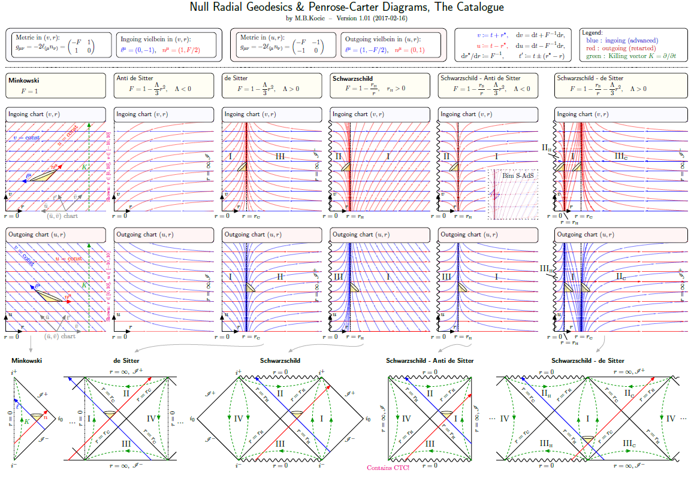

# NullRadialGeodesics

Null radial geodesics and Penrose-Carter diagrams

See [Null Radial Geodesics Catalogue.pdf](https://github.com/mekeetsa/NullRadialGeodesics/blob/master/Null%20Radial%20Geodesics%20Catalogue.pdf)

